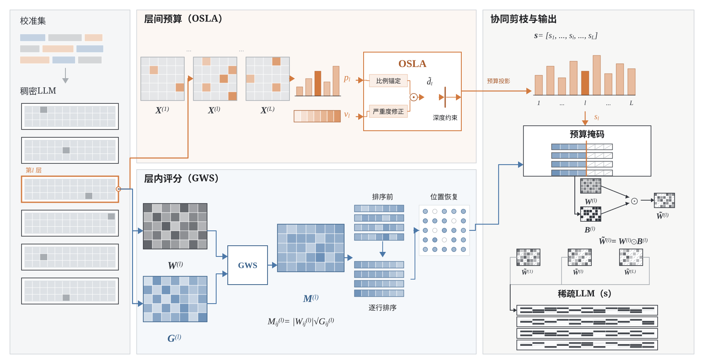

<div align="center">

# GS-OWL

**Dual-Scale Sensitivity Coordination for Post-Training Pruning of Large Language Models**

[](https://www.python.org/)
[](https://pytorch.org/)
[](LICENSE)

Research implementation and reproducibility package for GS-OWL.

</div>

<p align="center">
  
</p>

## Overview

GS-OWL is a post-training unstructured pruning method that coordinates sensitivity at two scales:

- **OSLA (Outlier-Sensitive Layer Allocation)** estimates how much each Transformer layer should be pruned. It combines activation-outlier proportion and severity, applies depth-aware constraints, and projects the resulting layer budgets to the global sparsity target.
- **GWS (Gradient-Weighted Saliency)** determines which connections to prune inside each layer. It scores each connection using weight magnitude and a nonnegative L2-aggregated gradient signal, then performs row-wise ranking under the OSLA budget.

The connection score is

```text
M_ij^(l) = |W_ij^(l)| * (G_ij^(l))^beta,
```

where the fixed main-experiment setting uses `beta = 0.5`. The current command-line name `owl-v9-wsqrtg` is retained for compatibility with the experiment code; it corresponds to GS-OWL in the manuscript.

## Fixed Main Configuration

The formal main protocol uses one configuration across models, sparsity levels, and downstream evaluations. It is not reselected using test-set results.

| Parameter | Value | Role |
| --- | ---: | --- |
| `H_m` | `5` | activation-outlier threshold multiplier |
| `lambda` | `0.08` | layer-budget adjustment range |
| `alpha` | `0.20` | outlier-severity fusion coefficient |
| `beta` | `0.5` | GWS gradient exponent |
| Calibration samples | `128` | fixed calibration-set size |
| Sequence length | `2048` | calibration input length |
| Seed | `0` | calibration random seed |
| Gradient aggregation | `L2` | offline nonnegative aggregate |
| Intra-layer selection | row-wise | fixed connection-ranking rule |

## Repository Layout

```text
gs-owl/
|-- main.py                         # pruning and evaluation entry point
|-- lib/                            # OSLA, GWS, baselines, and evaluation code
|-- scripts/                        # experiment, analysis, and plotting utilities
|-- data/plant_mcq/                 # cleaned plant-science MCQ benchmark
|-- lm-evaluation-harness/          # zero-shot evaluation dependency
|-- paper/computer_engineering_latex/
|   |-- main*.tex                   # manuscript sources
|   |-- draw_*.py                   # editable framework-figure generators
|   `-- figures/*.svg               # editable vector figures
|-- INSTALL.md
`-- REPRODUCIBILITY.md
```

Model weights, gradient checkpoints, generated masks, experiment outputs, and paper build products are intentionally excluded from Git.

## Installation

Create a Python 3.9 environment and install the project dependencies:

```bash
conda create -n gs-owl python=3.9 -y
conda activate gs-owl

pip install -r requirements.txt
pip install -e ./lm-evaluation-harness
```

See [INSTALL.md](INSTALL.md) for the environment versions used by the original experiments. Access to gated model checkpoints must be configured separately through Hugging Face.

## Quick Start

### 1. Compute offline aggregate gradients

GWS reuses an offline L2-aggregated gradient checkpoint. The same checkpoint can be reused across sparsity levels for a fixed model and calibration protocol.

```bash
python lib/gradient_computation.py \
  --model meta-llama/Llama-2-7b-hf \
  --llama_version 2 \
  --nsamples 128 \
  --seqlen 2048 \
  --seed 0 \
  --save_root gradients
```

### 2. Run GS-OWL pruning

The following example prunes LLaMA-2-7B to 60% unstructured sparsity and evaluates WikiText-2 perplexity:

```bash
python main.py \
  --model meta-llama/Llama-2-7b-hf \
  --prune_method owl-v9-wsqrtg \
  --sparsity_ratio 0.60 \
  --sparsity_type unstructured \
  --Hyper_m 5 \
  --Lamda 0.08 \
  --Owl_alpha 0.20 \
  --Grad_beta 0.5 \
  --nsamples 128 \
  --seed 0 \
  --gradient_path /path/to/gradients_l2_checkpoint.pth \
  --save outputs/llama2-7b/s60
```

Replace the model identifier and gradient path with local or Hugging Face paths available in your environment. Use `--eval_dataset c4` for C4 perplexity.

## Evaluation

### Seven-task zero-shot evaluation

Add `--eval_zero_shot` to the pruning command. One generated sparse mask is evaluated on all seven tasks:

```text
BoolQ, RTE, HellaSwag, ARC-Challenge, ARC-Easy, WinoGrande, OpenBookQA
```

To save the sparse checkpoint rather than using a temporary directory, also provide:

```bash
--save_model outputs/llama2-7b/s60/checkpoint
```

### Plant-science MCQ evaluation

Evaluate a dense or previously saved sparse checkpoint using conditional option log-likelihood:

```bash
python scripts/eval_plant_mcq.py \
  --model llama2-7b-s60=/path/to/checkpoint \
  --questions data/plant_mcq/mobiplant_expert_clean_v2.jsonl \
  --output outputs/plant_mcq/llama2-7b-s60.json
```

The question-set SHA-256 hash is stored with every result to make dense and sparse evaluations auditable.

## Reproducibility Notes

- Use the same model revision, calibration samples, sequence length, seed, and gradient checkpoint when comparing methods.
- Generate one sparse mask per model-sparsity pair and reuse it across all zero-shot tasks.
- Report the realized sparsity printed by `check_sparsity`, not only the requested target.
- Unstructured parameter sparsity does not by itself imply wall-clock speedup on general-purpose GPUs.
- Generated files are written under ignored directories such as `outputs/`, `owl/`, and `gradients/`.

Additional protocol notes are available in [REPRODUCIBILITY.md](REPRODUCIBILITY.md).

## Paper and Figures

The manuscript sources and editable scientific figures are in [`paper/computer_engineering_latex`](paper/computer_engineering_latex). Generated PDF and PNG files are excluded; regenerate figures with the Python drawing scripts in that directory.

## Acknowledgements

This implementation builds on the public code and ideas of Pruner-Zero, Wanda, SparseGPT, OWL, GBLM-Pruner, and the EleutherAI LM Evaluation Harness. Their original licenses and attribution notices remain applicable to the corresponding reused components.

## License

This repository is released under the [MIT License](LICENSE).

## Citation

The GS-OWL paper citation will be added when the manuscript metadata is publicly available.
